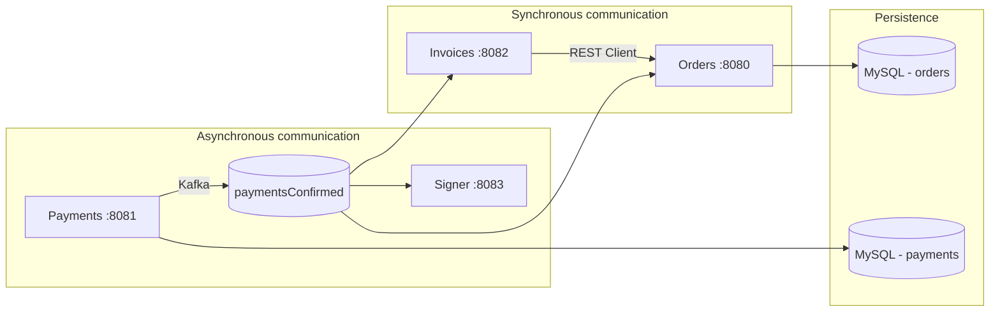

# Florinda Eats Technologies

This document describes the technologies used in **florinda-eats-microservices**, the role of each one in the architecture, and where they appear in the code.

## Architecture overview

Florinda Eats is a food delivery application organized as **microservices**. Each service is an independent Quarkus application with its own responsibility. Services communicate in two ways:

- **Synchronous (HTTP/REST)** — when one service needs data from another immediately (e.g. Invoices fetches order data from the Orders service).
- **Asynchronous (Kafka)** — when a business event must be propagated to multiple consumers (e.g. payment confirmation).

---

## Services and responsibilities

| Service | Module | Port | Database | Kafka | REST |
|---------|--------|------|----------|-------|------|
| **Orders** | `orders/` | 8080 | Yes (MySQL) | Consumer | Yes |
| **Payments** | `payments/` | 8081 | Yes (MySQL) | Producer | Yes |
| **Invoices** | `invoices/` | 8082 | No | Consumer | Yes |
| **Signer** | `signer/` | 8083 | No | Consumer | Yes |

---

## Technologies by category

### Platform and build

#### Quarkus 3.31.1

**Cloud-native** Java framework used by all four microservices. Provides fast startup, low memory usage, and native integration with REST, databases, Kafka, and dependency injection.

- **Where:** all modules (`orders`, `payments`, `invoices`, `signer`)
- **How to run:** `mvn quarkus:dev` (Quarkus Maven plugin)
- **Files:** `pom.xml` in each service

#### Java 25

Java language version used in the project (`maven.compiler.release=25`).

- **Where:** source code in all services
- **Features used:** POJO classes, text blocks (`"""`) in `OrderService.invoice()`, `LocalDateTime`, `UUID`

#### Maven

Build tool and dependency manager. Each service is an independent Maven project with its own `pom.xml`.

- **Where:** root of each module (`pom.xml`, `mvnw`)
- **Relevant plugins:** `quarkus-maven-plugin`, `maven-compiler-plugin`, `maven-surefire-plugin`

---

### REST APIs

#### Quarkus REST (JAX-RS)

Extension for exposing HTTP endpoints. Uses Jakarta REST annotations (`@Path`, `@GET`, `@PUT`, `@POST`) and supports reactive programming with `Uni<T>` as the return type.

- **Where:**
  - `OrderResource`, `MenuItemResource` — **Orders** service
  - `PaymentResource` — **Payments** service
  - `InvoiceResource` — **Invoices** service
- **Dependency:** `quarkus-rest`
- **Example:** list orders at `GET /orders`

#### Jackson (JSON)

JSON serialization and deserialization for REST requests/responses.

- **Where:** all REST endpoints and Kafka events (objects converted to JSON)
- **Dependency:** `quarkus-rest-jackson`

#### MicroProfile REST Client

Declarative HTTP client for calling other microservices. The `OrderService` interface describes the Orders service endpoints; Quarkus generates the implementation at build time.

- **Where:** **Invoices** service
  - `OrderService` — REST Client interface pointing to `http://localhost:8080`
  - `PaymentConfirmedConsumer` — fetches order data when generating an invoice
  - `InvoiceResource` — endpoint `GET /invoices/order/{orderId}`
- **Dependencies:** `quarkus-rest-client`, `quarkus-rest-client-jackson`
- **Configuration:** `quarkus.rest-client."mx.florinda.invoice.OrderService".url` in `invoices/src/main/resources/application.properties`

---

### Reactive programming

#### SmallRye Mutiny (`Uni`)

Reactive library in the Quarkus ecosystem. `Uni<T>` represents an asynchronous operation that produces **zero or one** result (database query, HTTP call, message consumption).

- **Where:** nearly all REST resources and Kafka consumers return `Uni<T>`
- **Examples:**
  - `PaymentResource.confirm()` — confirms payment and publishes event
  - `OrderResource.list()` — lists orders from the database
  - `PaymentConfirmedConsumer.consume()` — processes Kafka event

#### Hibernate Reactive Panache

**Non-blocking** persistence layer on top of Hibernate ORM. Entities extend `PanacheEntity` and operations return `Uni<T>` instead of blocking threads.

- **Where:** **Orders** and **Payments** services
- **Entities:** `Order`, `OrderItem`, `MenuItem`, `Payment`
- **Operations used:** `findById()`, `listAll()`, `persist()`, `Panache.withTransaction()`
- **Dependency:** `quarkus-hibernate-reactive-panache`

#### Reactive MySQL Client

Reactive MySQL driver (Vert.x), used by Hibernate Reactive to access the database without blocking threads.

- **Where:** **Orders** and **Payments**
- **Dependency:** `quarkus-reactive-mysql-client`

> **Note:** `pom.xml` files also include `quarkus-jdbc-mysql` and `quarkus-hibernate-orm-panache`, required for **Flyway** to run migrations via JDBC at startup. Runtime application access is reactive.

---

### Database and migrations

#### MySQL

Relational database storing menu, order, and payment data.

- **Where:**
  - **Orders** — `MenuItem`, `Order`, `OrderItem` tables
  - **Payments** — `Payment` table
- **Scripts:** `orders/src/main/resources/db/migration/` and `payments/src/main/resources/db/migration/`

#### Flyway

**Schema versioning** tool. Numbered SQL scripts (`V0001__...`, `V0002__...`) are applied automatically on application startup.

- **Where:** **Orders** and **Payments**
- **Configuration:** `quarkus.flyway.migrate-at-start=true`
- **Dependency:** `quarkus-flyway`
- **Example migrations:**
  - `V0001__create-menu-item-table.sql` — menu structure
  - `V0003__create-order-and-order-item-tables.sql` — orders and items
  - `V0001__create-payment-table.sql` — payments

#### Hibernate ORM (validate mode)

Validates that the database schema matches JPA entities without modifying tables (schema changes are handled by Flyway).

- **Configuration:** `quarkus.hibernate-orm.database.generation=validate`
- **Where:** `application.properties` in **Orders**, **Payments**, and **Invoices**

#### Jakarta Persistence (JPA)

Object-relational mapping standard. Entities use `@Entity`, `@OneToMany`, `@Embedded`, `@Enumerated`.

- **Where:**
  - `Order`, `OrderItem`, `MenuItem` — **Orders**
  - `Payment` — **Payments**
  - `Customer` — `@Embeddable` inside `Order`

---

### Messaging and events

#### Apache Kafka

Message broker for **asynchronous** communication between microservices. When a payment is confirmed, an event is published and consumed independently by Orders, Invoices, and Signer.

- **Where:** infrastructure via `docker-compose.yml`
- **Main topic:** `paymentsConfirmed` (3 partitions)
- **Port:** `localhost:9092`
- **Libraries:** [kafka-libraries.md](kafka-libraries.md)
- **How it works:** [kafka-how-it-works.md](kafka-how-it-works.md)
- **Command guide:** [kafka-commands.md](kafka-commands.md)
- **Event flow and tests:** [kafka-event-flow.md](kafka-event-flow.md)

#### MicroProfile Reactive Messaging

API for producing and consuming messages reactively, integrated with Kafka by Quarkus.

- **Production (outgoing):**
  - `PaymentResource` uses `@Channel("paymentsConfirmed")` and `Emitter<PaymentConfirmedEvent>` to publish after `PUT /payments/{id}`
- **Consumption (incoming):**
  - `PaymentConfirmedConsumer` in **Orders**, **Invoices**, and **Signer** with `@Incoming("paymentsConfirmed")`
- **Dependency:** `quarkus-messaging-kafka`
- **Configuration:** `kafka.bootstrap.servers=localhost:9092`

#### `PaymentConfirmedEvent`

JSON payload published to Kafka when a payment is confirmed. Contains `eventId`, `eventTimestamp`, `paymentId`, `orderId`, and `amount`.

- **Where:** duplicated class in each service that produces or consumes the event
- **Flow:** Payments confirms → Kafka → Orders updates status to `PAID` / Invoices generates XML / Signer generates MD5 hash

---

### Dependency injection

#### CDI / Quarkus Arc

Dependency injection container (CDI implementation). Manages application-scoped beans and field/constructor injection.

- **Where:**
  - `@ApplicationScoped` — `PaymentConfirmedConsumer`, `Hash`
  - `@Inject` — injection of `Hash` and `Emitter`
  - `@RestClient` — HTTP client injection in Invoices
- **Dependency:** `quarkus-arc`

---

### Infrastructure and containers

#### Docker Compose

Orchestrates local infrastructure and all microservices. Starts **Kafka**, **MySQL**, and the four Quarkus apps.

- **File:** `docker-compose.yml` (project root)
- **Command:** `docker compose up --build`

#### Jib

Plugin to build Docker images of Quarkus services without a manual Dockerfile (alternative to generated Dockerfiles).

- **Dependency:** `quarkus-container-image-jib` (all services)

#### Dockerfiles (Quarkus)

Templates generated by Quarkus to package the application in a container:

- `Dockerfile.jvm` — traditional JVM image
- `Dockerfile.native` — GraalVM native image
- `Dockerfile.native-micro` — optimized native image
- `Dockerfile.legacy-jar` — classic JAR

- **Where:** `src/main/docker/` in each service

#### GraalVM Native (optional profile)

Maven `native` profile to compile the application into a native binary (faster startup, smaller footprint).

- **How to use:** `mvn package -Dnative`
- **Where:** `native` profile in each `pom.xml`

---

### Testing and auxiliary tools

#### JUnit 5

Unit and integration testing framework.

- **Dependency:** `quarkus-junit5` (test scope)
- **Where:** `orders/src/test/java/`

#### REST Assured

Library for fluent REST API testing in automated tests.

- **Dependency:** `rest-assured` (test scope)

#### Postman

HTTP collections for manually testing each service's endpoints.

- **Unified collection:** `florinda-eats.postman_collection.json` (project root)
- **Per-service collections:**
  - `orders/florinda-eats-orders.postman_collection.json`
  - `payments/florinda-eats-payments.postman_collection.json`
  - `invoices/florinda-eats-invoices.postman_collection.json`

---

### Other point technologies

#### MD5 (`MessageDigest`)

Hash algorithm used by the **Signer** service to generate a signature of the confirmed payment event.

- **Where:** `Hash` class in `signer/src/main/java/mx/florinda/signer/Hash.java`
- **Usage:** `hash.generateHash(event.toString())` prints the hash to the console

#### RESTEasy Reactive (`RestResponse`)

HTTP response type used when creating menu items with `201 Created` status.

- **Where:** `MenuItemResource.create()` returns `Uni<RestResponse<MenuItem>>`

---

## Quarkus dependency map by service

| Quarkus extension | Orders | Payments | Invoices | Signer |
|-------------------|:------:|:--------:|:--------:|:------:|
| `quarkus-rest` | ✓ | ✓ | ✓ | ✓ |
| `quarkus-rest-jackson` | ✓ | ✓ | ✓ | ✓ |
| `quarkus-arc` | ✓ | ✓ | ✓ | ✓ |
| `quarkus-flyway` | ✓ | ✓ | | |
| `quarkus-jdbc-mysql` | ✓ | ✓ | | |
| `quarkus-hibernate-orm-panache` | ✓ | ✓ | | |
| `quarkus-hibernate-reactive-panache` | ✓ | ✓ | | |
| `quarkus-reactive-mysql-client` | ✓ | ✓ | | |
| `quarkus-messaging-kafka` | ✓ | ✓ | ✓ | ✓ |
| `quarkus-rest-client` | | | ✓ | |
| `quarkus-rest-client-jackson` | | | ✓ | |
| `quarkus-container-image-jib` | ✓ | ✓ | ✓ | ✓ |

---

## Full flow: payment confirmation

This flow shows how the technologies work together:

1. **Postman** sends `PUT http://localhost:8081/payments/1`
2. **Quarkus REST** receives the request in `PaymentResource`
3. **Hibernate Reactive Panache** updates the payment status inside a transaction (`Panache.withTransaction`)
4. **MicroProfile Reactive Messaging** publishes `PaymentConfirmedEvent` to **Kafka** (`Emitter` + topic `paymentsConfirmed`)
5. Three consumers react in parallel:
   - **Orders** — updates `Order.status` to `PAID` via Hibernate Reactive
   - **Invoices** — calls **REST Client** on Orders, builds XML, and prints to console
   - **Signer** — computes **MD5** of the event and prints to console

For event flows and verification tests, see [kafka-event-flow.md](kafka-event-flow.md).
