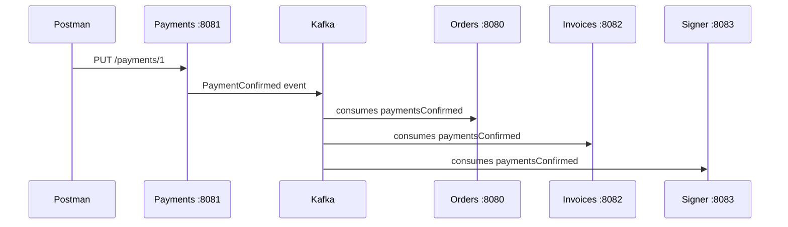

# Kafka Commands — Florinda Eats

Step-by-step guide to start Kafka, manage topics, and test messages in the **florinda-eats-microservices** project.

## Prerequisites

Kafka runs via Docker Compose at the project root:

```sh
docker compose up -d
```

Wait for the `kafka` container to be ready. Quarkus services (`orders`, `payments`, `invoices`, `signer`) connect to `localhost:9092`.

---

## 1. List existing topics

Check that the broker is responding and see which topics already exist:

```sh
docker exec -it kafka /opt/kafka/bin/kafka-topics.sh --list --bootstrap-server localhost:9092
```

**Expected result (initial):** only `__consumer_offsets`.

---

## 2. Create the `paymentsConfirmed` topic

This is the topic used by the **Payments** service when confirming a payment (`PUT /payments/{id}`):

```sh
docker exec -it kafka /opt/kafka/bin/kafka-topics.sh --create --topic paymentsConfirmed --bootstrap-server localhost:9092
```

**Expected result:** `Created topic paymentsConfirmed.`

The `docker-compose.yml` sets `KAFKA_NUM_PARTITIONS: 3`, so the topic is created with 3 partitions.

---

## 3. Describe the topic

Confirm partitions, leaders, and replication factor:

```sh
docker exec -it kafka /opt/kafka/bin/kafka-topics.sh --describe --topic paymentsConfirmed --bootstrap-server localhost:9092
```

**Expected result:**

```
Topic: paymentsConfirmed  PartitionCount: 3  ReplicationFactor: 1
  Partition: 0  Leader: 1  Replicas: 1  Isr: 1
  Partition: 1  Leader: 1  Replicas: 1  Isr: 1
  Partition: 2  Leader: 1  Replicas: 1  Isr: 1
```

---

## 4. Publish messages manually (console producer)

> **Note:** Manual publishing triggers consumers only. See [kafka-event-flow.md](kafka-event-flow.md) for flows and tests.

Command with **key and value** separated by `;`:

```sh
docker exec -it kafka /opt/kafka/bin/kafka-console-producer.sh \
  --bootstrap-server localhost:9092 \
  --property "parse.key=true" \
  --property "key.separator=;" \
  --topic paymentsConfirmed
```

**Input format at the `>` prompt:**

```
1;{"paymentId": 1, "orderId": 1, "amount": 25.50}
2;{"paymentId": 2, "orderId": 2, "amount": 30.00}
```

- Before `;` → **key** (e.g. payment ID)
- After `;` → **value** (event JSON)

To exit: `Ctrl+C`.

Simple version (no key):

```sh
docker exec -it kafka /opt/kafka/bin/kafka-console-producer.sh \
  --bootstrap-server localhost:9092 \
  --topic paymentsConfirmed
```

---

## 5. Consume messages (console consumer)

Validate what was published:

```sh
docker exec -it kafka /opt/kafka/bin/kafka-console-consumer.sh --bootstrap-server localhost:9092 --topic paymentsConfirmed --from-beginning
```

With a consumer group:

```sh
docker exec -it kafka /opt/kafka/bin/kafka-console-consumer.sh --bootstrap-server localhost:9092 --topic paymentsConfirmed --from-beginning --group test
```

---

## 6. View consumer groups

Useful after starting the Quarkus services:

```sh
docker exec -it kafka /opt/kafka/bin/kafka-consumer-groups.sh \
  --bootstrap-server localhost:9092 \
  --all-groups \
  --describe
```

---

## Project flow



---

## Recommended execution order

| # | Action | Command |
|---|--------|---------|
| 1 | Start Kafka | `docker compose up -d` |
| 2 | List topics | `--list` |
| 3 | Create topic | `--create --topic paymentsConfirmed` |
| 4 | Describe topic | `--describe --topic paymentsConfirmed` |
| 5 | Test producer (optional) | `kafka-console-producer.sh` with `parse.key=true` |
| 6 | Start Quarkus services | `quarkus:dev` in each module |
| 7 | Confirm payment | `PUT http://localhost:8081/payments/1` |

---

## Notes

- **`docker exec -it`** — `-it` is required for interactive commands (producer/consumer).
- **Port** — use `localhost:9092` inside the container and on the host (mapped in `docker-compose.yml`).
- **Topic** — always use `paymentsConfirmed` (the name used in `PaymentResource`, `orders`, `invoices`, and `signer`).
- **Docker Compose** — `docker compose up` creates the topic automatically via `kafka-init`; steps 2–3 are only needed when running Kafka standalone.

---

## Quick reference

```sh
# List topics
docker exec -it kafka /opt/kafka/bin/kafka-topics.sh --list --bootstrap-server localhost:9092

# Create topic
docker exec -it kafka /opt/kafka/bin/kafka-topics.sh --create --topic paymentsConfirmed --bootstrap-server localhost:9092

# Describe topic
docker exec -it kafka /opt/kafka/bin/kafka-topics.sh --describe --topic paymentsConfirmed --bootstrap-server localhost:9092

# Produce (with key)
docker exec -it kafka /opt/kafka/bin/kafka-console-producer.sh \
  --bootstrap-server localhost:9092 \
  --property "parse.key=true" \
  --property "key.separator=;" \
  --topic paymentsConfirmed
# >1;{"paymentId": 1, "orderId": 1, "amount": 9.48}

# Consume from beginning
docker exec -it kafka /opt/kafka/bin/kafka-console-consumer.sh \
  --bootstrap-server localhost:9092 \
  --topic paymentsConfirmed \
  --from-beginning

# Consumer groups
docker exec -it kafka /opt/kafka/bin/kafka-consumer-groups.sh \
  --bootstrap-server localhost:9092 \
  --all-groups \
  --describe
```

For event flows and end-to-end tests, see [kafka-event-flow.md](kafka-event-flow.md).
