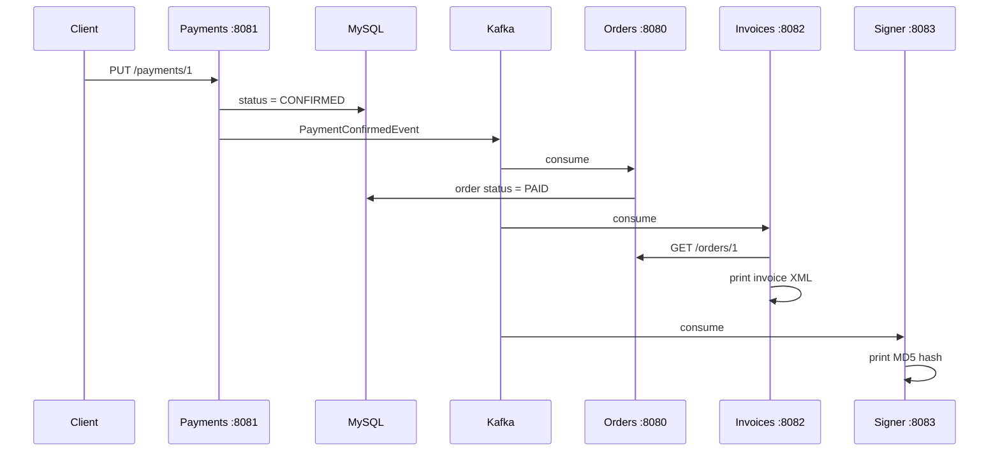
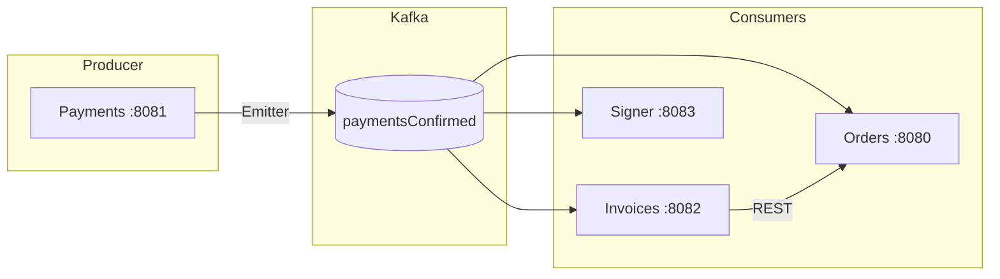
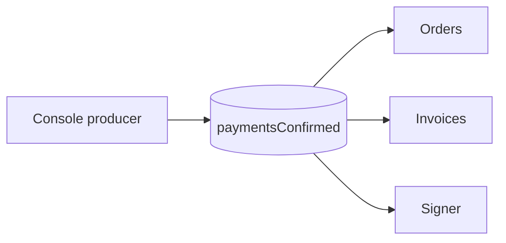

# Kafka Event Flow — Florinda Eats

## Flows

### REST confirmation (full flow)



### Kafka topology



| Service | Kafka role | On event |
|---------|------------|----------|
| **Payments** | Producer | Publishes after `PUT /payments/{id}` |
| **Orders** | Consumer | Sets order status to `PAID` |
| **Invoices** | Consumer | Fetches order, prints invoice XML |
| **Signer** | Consumer | Prints MD5 hash |

### Manual console producer (partial flow)



Triggers consumers only. Does **not** update the payment in MySQL. Payload must include `amount`:

```
1;{"paymentId": 1, "orderId": 1, "amount": 9.48}
```

See [kafka-commands.md](kafka-commands.md) for producer commands.

---

## Tests

### Prerequisites

```sh
docker compose up -d
docker compose ps   # orders, payments, invoices, signer, kafka, mysql all Up
```

### REST flow

```sh
# 1. Confirm payment
curl -X PUT http://localhost:8081/payments/1

# 2. Payment updated
curl http://localhost:8081/payments/1
# expected: "status":"CONFIRMED"

# 3. Order updated
curl http://localhost:8080/orders/1
# expected: "status":"PAID"

# 4. Consumer logs
docker compose logs orders invoices signer
# orders   → PaymentConfirmedEvent + order updated
# invoices → invoice XML printed
# signer   → MD5 hash printed
```

### Manual Kafka flow

```sh
# 1. Publish event (inside kafka container prompt)
docker exec -it kafka /opt/kafka/bin/kafka-console-producer.sh \
  --bootstrap-server localhost:9092 \
  --property "parse.key=true" \
  --property "key.separator=;" \
  --topic paymentsConfirmed
# type: 1;{"paymentId": 1, "orderId": 1, "amount": 9.48}

# 2. Order updated (payment status unchanged)
curl http://localhost:8080/orders/1
# expected: "status":"PAID"

# 3. Consumer logs
docker compose logs orders invoices signer
```

### Kafka topic

```sh
docker exec -it kafka /opt/kafka/bin/kafka-topics.sh \
  --list --bootstrap-server localhost:9092
# expected: paymentsConfirmed
```
