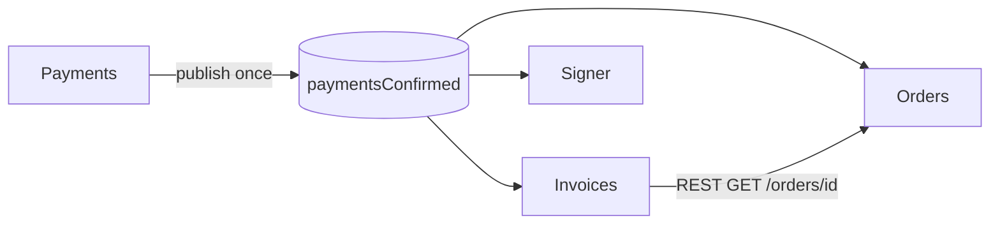
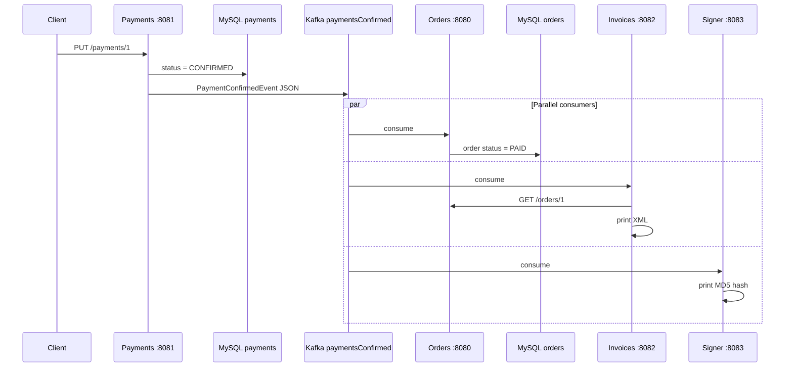
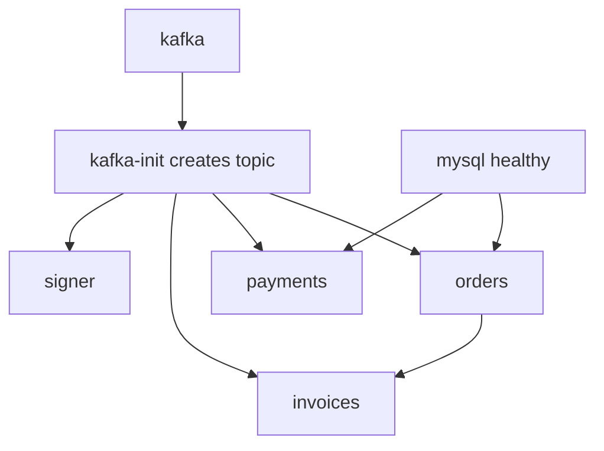

# How Kafka Works — Florinda Eats

This document explains **how Kafka is used** in **florinda-eats-microservices**: infrastructure setup, topic design, producer and consumer code, configuration profiles, and the difference between REST-triggered and manual event publishing.

For library details, see [kafka-libraries.md](kafka-libraries.md). For CLI commands and tests, see [kafka-commands.md](kafka-commands.md) and [kafka-event-flow.md](kafka-event-flow.md).

---

## Why Kafka here?

When a payment is confirmed, three services must react:

1. **Orders** — mark the order as paid in MySQL
2. **Invoices** — generate and print invoice XML
3. **Signer** — compute and print an MD5 hash of the event

Kafka implements the **publish/subscribe** pattern: Payments publishes one event; each consumer processes it independently. Payments does not call Orders, Invoices, or Signer directly.



Invoices still uses **REST** to fetch order details — Kafka carries the *notification*, not the full order payload.

---

## Infrastructure

### Docker Compose services

Defined in `docker-compose.yml`:

| Service | Purpose |
|---------|---------|
| `kafka` | Single-node KRaft broker (broker + controller) |
| `kafka-init` | One-shot job that creates topic `paymentsConfirmed`, then exits |
| `orders`, `payments`, `invoices`, `signer` | Quarkus apps; start after `kafka-init` completes |

### Listeners and addresses

The Kafka container exposes two listeners:

| Listener | Address | Used by |
|----------|---------|---------|
| `EXTERNAL` | `localhost:9092` | Host machine, local `quarkus:dev`, CLI tools |
| `PLAINTEXT` | `kafka:29092` | Microservices inside Docker Compose |

Each Quarkus service sets:

```properties
kafka.bootstrap.servers=localhost:9092          # default (local dev)
%docker.kafka.bootstrap.servers=kafka:29092     # Docker profile
```

When running `docker compose up`, services get `QUARKUS_PROFILE=docker` and connect to `kafka:29092`.

### Topic creation

The `kafka-init` container waits for the broker, then runs:

```sh
kafka-topics.sh --create --if-not-exists --topic paymentsConfirmed --bootstrap-server kafka:29092
```

For local development without full Compose, create the topic manually — see [kafka-commands.md](kafka-commands.md).

### Topic layout

| Property | Value |
|----------|-------|
| Name | `paymentsConfirmed` |
| Partitions | 3 (from `KAFKA_NUM_PARTITIONS`) |
| Replication factor | 1 (single broker) |
| Message format | JSON (`PaymentConfirmedEvent`) |

Partition count allows parallel consumption within a consumer group. With three separate services, each has its own consumer group and receives **every** message on the topic.

---

## Channel and topic mapping

Quarkus uses **convention over configuration** for this project. No `mp.messaging.outgoing.*` or `mp.messaging.incoming.*` properties are required.

| Code annotation | Channel name | Kafka topic |
|-----------------|--------------|-------------|
| `@Channel("paymentsConfirmed")` | `paymentsConfirmed` | `paymentsConfirmed` |
| `@Incoming("paymentsConfirmed")` | `paymentsConfirmed` | `paymentsConfirmed` |

The channel name in Java matches the Kafka topic name. The `quarkus-messaging-kafka` extension connects them automatically.

---

## Event payload: `PaymentConfirmedEvent`

Published when `PUT /payments/{id}` confirms a payment.

| Field | Type | Set by | Purpose |
|-------|------|--------|---------|
| `eventId` | `UUID` | Constructor | Unique id for this event instance |
| `eventTimestamp` | `LocalDateTime` | Constructor | When the event was created |
| `paymentId` | `Long` | Payment record | Which payment was confirmed |
| `orderId` | `Long` | Payment record | Which order to update / invoice |
| `amount` | `BigDecimal` | Payment record | Amount used in invoice XML |

The same class exists in all four modules so each service can deserialize JSON independently.

---

## Producer: Payments service

**Trigger:** `PUT http://localhost:8081/payments/{id}`

**Flow:**

1. `PaymentResource.confirm()` starts a Hibernate Reactive transaction
2. Loads the payment by id; sets `status = CONFIRMED`
3. Builds `PaymentConfirmedEvent` from `payment.id`, `payment.orderId`, `payment.amount`
4. Calls `emitter.send(event)` — message goes to Kafka **inside** the transaction callback

```java
PaymentConfirmedEvent event =
    new PaymentConfirmedEvent(payment.id, payment.orderId, payment.amount);
emitter.send(event);
```

**File:** `payments/src/main/java/mx/florinda/payment/PaymentResource.java`

After a successful `PUT`, the payment row in MySQL is `CONFIRMED` and the event is on the topic.

---

## Consumers

Each consumer subscribes to `paymentsConfirmed` with `@Incoming`. Quarkus assigns a **separate consumer group** per application, so all three services receive the same event.

### Orders — update order status

```java
@Incoming("paymentsConfirmed")
public Uni<Void> consume(PaymentConfirmedEvent event) {
  return Panache.withTransaction(() ->
      Order.findById(event.orderId)
          .onItem().ifNotNull().invoke(order -> order.status = OrderStatus.PAID)
  ).replaceWithVoid();
}
```

- Uses `event.orderId` to find the order
- Sets status to `PAID` in MySQL
- Logs the event to stdout

**File:** `orders/src/main/java/mx/florinda/order/PaymentConfirmedConsumer.java`

### Invoices — generate XML

```java
@Incoming("paymentsConfirmed")
public Uni<Void> consume(PaymentConfirmedEvent event) {
  return orderService.invoice(event.orderId, event.amount)
      .onItem().invoke(xml -> System.out.println(xml))
      .replaceWithVoid();
}
```

- Calls Orders REST API (`GET /orders/{id}`) via `OrderService` REST Client
- Builds XML with customer data and `event.amount`
- Prints XML to stdout

**Files:**

- `invoices/src/main/java/mx/florinda/invoice/PaymentConfirmedConsumer.java`
- `invoices/src/main/java/mx/florinda/invoice/OrderService.java`

REST Client URL:

```properties
quarkus.rest-client."mx.florinda.invoice.OrderService".url=http://localhost:8080
%docker.quarkus.rest-client."mx.florinda.invoice.OrderService".url=http://orders:8080
```

### Signer — MD5 hash

```java
@Incoming("paymentsConfirmed")
public Uni<Void> consume(PaymentConfirmedEvent event) {
  String generatedHash = hash.generateHash(event.toString());
  System.out.println(generatedHash);
  return Uni.createFrom().voidItem();
}
```

- Hashes the `toString()` representation of the event (includes `eventId`, timestamp, ids, amount)
- Prints hex MD5 to stdout

**Files:**

- `signer/src/main/java/mx/florinda/signer/PaymentConfirmedConsumer.java`
- `signer/src/main/java/mx/florinda/signer/Hash.java`

---

## End-to-end sequence (REST flow)



**Verify:**

```sh
curl -X PUT http://localhost:8081/payments/1
curl http://localhost:8081/payments/1   # "status":"CONFIRMED"
curl http://localhost:8080/orders/1     # "status":"PAID"
docker compose logs orders invoices signer
```

More test scenarios: [kafka-event-flow.md](kafka-event-flow.md).

---

## Manual Kafka publishing (partial flow)

You can publish directly with the Kafka console producer without calling the Payments REST API.

```sh
docker exec -it kafka /opt/kafka/bin/kafka-console-producer.sh \
  --bootstrap-server localhost:9092 \
  --property "parse.key=true" \
  --property "key.separator=;" \
  --topic paymentsConfirmed
# > 1;{"paymentId": 1, "orderId": 1, "amount": 9.48}
```

| Aspect | REST flow (`PUT /payments/1`) | Manual Kafka publish |
|--------|-------------------------------|----------------------|
| Payment in MySQL | Updated to `CONFIRMED` | **Not** updated |
| Order in MySQL | Updated to `PAID` (Orders consumer) | Updated if consumer runs |
| Invoices / Signer | Process event | Process event |
| `eventId` / `eventTimestamp` | Set by Payments constructor | **Missing** unless you add them in JSON |

Manual messages must include `paymentId`, `orderId`, and `amount` at minimum. Invoices needs `amount`; Orders needs `orderId`.

---

## Consumer groups

Each Quarkus application gets its own Kafka consumer group (derived from the application name). That means:

- **Orders**, **Invoices**, and **Signer** each receive **every** message on `paymentsConfirmed`
- Offsets are tracked **per group** — one service falling behind does not block the others

Inspect groups after starting services:

```sh
docker exec -it kafka /opt/kafka/bin/kafka-consumer-groups.sh \
  --bootstrap-server localhost:9092 \
  --all-groups \
  --describe
```

---

## Startup dependencies



- **Invoices** depends on **Orders** (REST) and **kafka-init**
- **Signer** only needs Kafka
- All services disable Quarkus Dev Services for Kafka in Docker (`%docker.quarkus.devservices.enabled=false`) because Compose provides the broker

---

## Local development vs Docker Compose

| Mode | Kafka address | Topic creation | Services |
|------|---------------|----------------|----------|
| **Docker Compose** | `kafka:29092` (profile `docker`) | Automatic via `kafka-init` | All four in containers |
| **Local IntelliJ / `quarkus:dev`** | `localhost:9092` | Manual — see [kafka-commands.md](kafka-commands.md) | Run `docker compose up kafka mysql -d`, then start each module |

Minimum for local Kafka testing:

```sh
docker compose up kafka mysql -d
# create topic paymentsConfirmed (see kafka-commands.md)
# run quarkus:dev in payments, orders, invoices, signer
```

---

## Summary

| Component | Responsibility |
|-----------|----------------|
| **Kafka broker** | Durable log for `paymentsConfirmed` events |
| **Payments** | Sole producer; publishes after payment confirmation |
| **Orders** | Consumer; persists `PAID` status |
| **Invoices** | Consumer; REST call + XML output |
| **Signer** | Consumer; MD5 hash output |
| **Channel `paymentsConfirmed`** | Maps 1:1 to Kafka topic `paymentsConfirmed` |
| **`PaymentConfirmedEvent`** | JSON contract shared (duplicated) across services |

---

## Related documentation

| Document | Contents |
|----------|----------|
| [kafka-libraries.md](kafka-libraries.md) | Dependencies and APIs (`quarkus-messaging-kafka`, Mutiny, Jackson, etc.) |
| [kafka-event-flow.md](kafka-event-flow.md) | Diagrams and step-by-step verification tests |
| [kafka-commands.md](kafka-commands.md) | Topic and message CLI reference |
| [TECHNOLOGIES.md](TECHNOLOGIES.md) | Broader stack overview |
