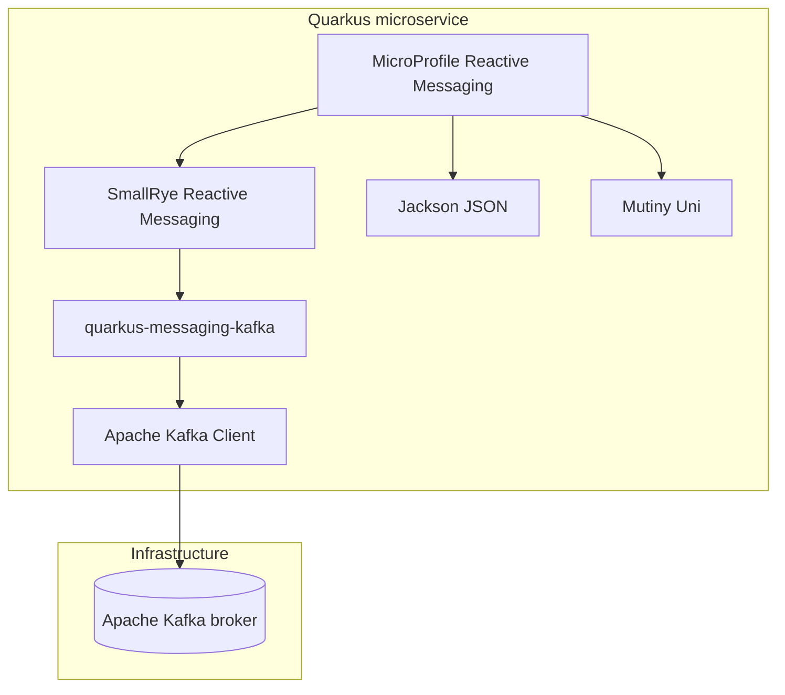

# Kafka Libraries — Florinda Eats

This document describes the libraries and extensions used for **Kafka messaging** in **florinda-eats-microservices**, how they relate to each other, and where they appear in the code.

For how events flow through the system, see [kafka-how-it-works.md](kafka-how-it-works.md). For CLI commands and manual testing, see [kafka-commands.md](kafka-commands.md).

---

## Stack overview



| Layer | Library / component | Role in this project |
|-------|---------------------|----------------------|
| Broker | **Apache Kafka** (`apache/kafka:latest`) | Stores and delivers `PaymentConfirmedEvent` messages on topic `paymentsConfirmed` |
| Quarkus extension | **`quarkus-messaging-kafka`** | Connects MicroProfile channels to Kafka topics and brokers |
| Messaging API | **MicroProfile Reactive Messaging** | `@Channel`, `@Incoming`, `Emitter` annotations used in application code |
| Implementation | **SmallRye Reactive Messaging** | Quarkus runtime that wires channels, serializers, and Kafka connectors |
| Client | **Apache Kafka Client** (`kafka-clients`) | Low-level producer/consumer protocol (pulled in transitively by Quarkus) |
| Serialization | **Jackson** (`quarkus-rest-jackson`) | Converts `PaymentConfirmedEvent` POJOs to/from JSON on the wire |
| Reactive types | **SmallRye Mutiny** (`Uni`) | Non-blocking return type for Kafka consumers |
| DI | **Quarkus Arc (CDI)** | Injects `Emitter`, REST clients, and helper beans into consumers |

---

## Apache Kafka (broker)

The message broker runs as a Docker container defined in `docker-compose.yml`.

- **Image:** `apache/kafka:latest`
- **Host port:** `localhost:9092` (external listener)
- **Docker network:** `kafka:29092` (internal listener used by microservices)
- **Topic:** `paymentsConfirmed` (created by the `kafka-init` service)
- **Partitions:** 3 (`KAFKA_NUM_PARTITIONS: 3`)

Kafka decouples the **Payments** producer from three independent consumers (**Orders**, **Invoices**, **Signer**). Each consumer reacts to the same event without the Payments service knowing who is listening.

---

## `quarkus-messaging-kafka`

Maven dependency present in all four services:

```xml
<dependency>
    <groupId>io.quarkus</groupId>
    <artifactId>quarkus-messaging-kafka</artifactId>
</dependency>
```

| Service | Module | Kafka role |
|---------|--------|------------|
| Payments | `payments/` | Producer |
| Orders | `orders/` | Consumer |
| Invoices | `invoices/` | Consumer |
| Signer | `signer/` | Consumer |

This extension:

- Registers Kafka as the default connector for MicroProfile channels
- Maps channel name `paymentsConfirmed` to Kafka topic `paymentsConfirmed` (same name by convention)
- Reads broker address from `kafka.bootstrap.servers`
- Handles consumer groups, offset commits, and JSON deserialization automatically

See [Configuration](#configuration) for all broker and channel settings.

---

## MicroProfile Reactive Messaging

Standard API for reactive messaging in Jakarta EE / MicroProfile. Imported from:

```java
import org.eclipse.microprofile.reactive.messaging.Channel;
import org.eclipse.microprofile.reactive.messaging.Emitter;
import org.eclipse.microprofile.reactive.messaging.Incoming;
```

### Producer (Payments)

`PaymentResource` injects an outgoing channel and sends events after confirming a payment:

```java
@Inject
@Channel("paymentsConfirmed")
Emitter<PaymentConfirmedEvent> emitter;

// inside confirm():
emitter.send(event);
```

- **`@Channel`** — names the outgoing channel (maps to Kafka topic)
- **`Emitter<T>`** — fire-and-forget publisher; Quarkus serializes `T` to JSON

**File:** `payments/src/main/java/mx/florinda/payment/PaymentResource.java`

### Consumers (Orders, Invoices, Signer)

Each service defines a `PaymentConfirmedConsumer` with:

```java
@Incoming("paymentsConfirmed")
public Uni<Void> consume(PaymentConfirmedEvent event) { ... }
```

- **`@Incoming`** — subscribes the method to the channel/topic
- Return type **`Uni<Void>`** — reactive, non-blocking handler

**Files:**

- `orders/src/main/java/mx/florinda/order/PaymentConfirmedConsumer.java`
- `invoices/src/main/java/mx/florinda/invoice/PaymentConfirmedConsumer.java`
- `signer/src/main/java/mx/florinda/signer/PaymentConfirmedConsumer.java`

---

## SmallRye Reactive Messaging

Implementation layer behind MicroProfile Reactive Messaging in Quarkus. You do not declare it explicitly in `pom.xml`; it comes with `quarkus-messaging-kafka`.

Responsibilities relevant to this project:

- Binds `@Incoming` / `@Channel` methods to Kafka connectors at build time
- Creates one **consumer group per service** (e.g. `orders`, `invoices`, `signer`)
- Deserializes JSON payloads into `PaymentConfirmedEvent` using Jackson
- Propagates messages to Mutiny `Uni` handlers

---

## Apache Kafka Client (`kafka-clients`)

Low-level Java client for the Kafka protocol. Included transitively by `quarkus-messaging-kafka`. Application code does not use it directly — Quarkus and SmallRye manage producers and consumers.

Useful when debugging: consumer group names and offsets shown by `kafka-consumer-groups.sh` reflect this client's behavior. See [kafka-commands.md](kafka-commands.md).

---

## Jackson (JSON serialization)

Dependency: **`quarkus-rest-jackson`** (all services).

Kafka events are JSON objects. Jackson maps fields on `PaymentConfirmedEvent` automatically:

```java
public class PaymentConfirmedEvent {
  public UUID eventId;
  public LocalDateTime eventTimestamp;
  public Long paymentId;
  public Long orderId;
  public BigDecimal amount;
}
```

The event class is **duplicated** in each module (`payments`, `orders`, `invoices`, `signer`) so each service can deserialize independently without sharing a common library.

**Example JSON** (produced by Payments):

```json
{
  "eventId": "a1b2c3d4-e5f6-7890-abcd-ef1234567890",
  "eventTimestamp": "2026-06-16T10:30:00",
  "paymentId": 1,
  "orderId": 1,
  "amount": 9.48
}
```

When publishing manually via the console producer, include at least `paymentId`, `orderId`, and `amount` — consumers depend on those fields.

---

## SmallRye Mutiny (`Uni`)

Reactive type used as the return value of Kafka consumers and many REST endpoints.

```java
public Uni<Void> consume(PaymentConfirmedEvent event) {
  return Panache.withTransaction(() -> ...).replaceWithVoid();
}
```

- **`Uni<T>`** — async computation that emits zero or one item
- Keeps the event loop non-blocking while consumers update the database or call REST APIs

Used together with:

- **Hibernate Reactive Panache** — Orders consumer updates order status inside `Panache.withTransaction`
- **MicroProfile REST Client** — Invoices consumer calls Orders via `orderService.invoice(...)`

---

## Related libraries (not Kafka, but used on the event path)

These are not Kafka libraries, but they run **inside** Kafka consumers:

| Library | Service | Role when event arrives |
|---------|---------|-------------------------|
| `quarkus-hibernate-reactive-panache` | Orders | Updates `Order.status` to `PAID` |
| `quarkus-reactive-mysql-client` | Orders | Reactive MySQL access for Panache |
| `quarkus-rest-client` + `quarkus-rest-client-jackson` | Invoices | Fetches order data from Orders (`GET /orders/{id}`) to build invoice XML |
| JDK `MessageDigest` (MD5) | Signer | Hashes the event string in `Hash.generateHash()` |

Invoices combines **async Kafka** with **sync REST**: the event triggers the consumer, which then calls Orders over HTTP.

---

## Dependency map by service

| Dependency | Payments | Orders | Invoices | Signer |
|------------|:--------:|:------:|:--------:|:------:|
| `quarkus-messaging-kafka` | ✓ | ✓ | ✓ | ✓ |
| `quarkus-rest-jackson` | ✓ | ✓ | ✓ | ✓ |
| `quarkus-arc` | ✓ | ✓ | ✓ | ✓ |
| `quarkus-hibernate-reactive-panache` | ✓ | ✓ | | |
| `quarkus-rest-client` | | | ✓ | |

---

## Configuration

This section lists every setting required to run Kafka messaging in this project: Maven dependency, broker infrastructure, Quarkus properties, and Java annotations.

### Configuration map

| Layer | Where | What to configure |
|-------|-------|-------------------|
| **`quarkus-messaging-kafka`** | `pom.xml` (each service) | Add the Maven dependency |
| **Apache Kafka broker** | `docker-compose.yml` | Listeners, partitions, topic bootstrap |
| **Kafka client** | `application.properties` | `kafka.bootstrap.servers` (+ `%docker` override) |
| **Dev Services** | `application.properties` | Disable auto Kafka container in Docker |
| **MicroProfile channels** | Java code | `@Channel` / `@Incoming("paymentsConfirmed")` |
| **Jackson** | No extra config | JSON via `quarkus-rest-jackson` (already on classpath) |
| **Mutiny** | Java code | Consumer methods return `Uni<Void>` |
| **REST Client** (Invoices only) | `application.properties` | Orders base URL for post-Kafka REST call |

No `mp.messaging.outgoing.*` or `mp.messaging.incoming.*` entries are required — Quarkus maps channel name `paymentsConfirmed` to Kafka topic `paymentsConfirmed` by convention.

---

### Maven — `quarkus-messaging-kafka`

Add to every service that produces or consumes events (`orders/`, `payments/`, `invoices/`, `signer/`):

```xml
<dependency>
    <groupId>io.quarkus</groupId>
    <artifactId>quarkus-messaging-kafka</artifactId>
</dependency>
```

Jackson serialization depends on **`quarkus-rest-jackson`**, which is already declared in all four modules. No separate Kafka serializer property is needed.

---

### Broker — `docker-compose.yml`

Kafka runs as a single-node KRaft broker. Relevant environment variables:

| Variable | Value | Purpose |
|----------|-------|---------|
| `KAFKA_LISTENERS` | `PLAINTEXT://0.0.0.0:29092`, `EXTERNAL://0.0.0.0:9092` | Internal and host-facing ports |
| `KAFKA_ADVERTISED_LISTENERS` | `PLAINTEXT://kafka:29092`, `EXTERNAL://localhost:9092` | Addresses clients use to connect |
| `KAFKA_NUM_PARTITIONS` | `3` | Default partition count for new topics |
| `KAFKA_OFFSETS_TOPIC_REPLICATION_FACTOR` | `1` | Single-broker setup |

Port mapping on the host:

```yaml
ports:
  - "9092:9092"
```

The **`kafka-init`** service creates the topic once the broker is up:

```sh
kafka-topics.sh --create --if-not-exists --topic paymentsConfirmed --bootstrap-server kafka:29092
```

Each microservice container sets `QUARKUS_PROFILE: docker` so `%docker.*` properties in `application.properties` apply.

---

### Quarkus — `application.properties`

#### Kafka broker address (all services)

| Property | Profile | Value | Used when |
|----------|---------|-------|-----------|
| `kafka.bootstrap.servers` | default | `localhost:9092` | Local `quarkus:dev`, IntelliJ |
| `%docker.kafka.bootstrap.servers` | `docker` | `kafka:29092` | `docker compose up` |

**Payments** (`payments/src/main/resources/application.properties`):

```properties
kafka.bootstrap.servers=localhost:9092

%docker.quarkus.devservices.enabled=false
%docker.kafka.bootstrap.servers=kafka:29092
```

**Orders** (`orders/src/main/resources/application.properties`):

```properties
kafka.bootstrap.servers=localhost:9092

%docker.quarkus.devservices.enabled=false
%docker.kafka.bootstrap.servers=kafka:29092
```

**Invoices** (`invoices/src/main/resources/application.properties`):

```properties
kafka.bootstrap.servers=localhost:9092

%docker.quarkus.devservices.enabled=false
%docker.kafka.bootstrap.servers=kafka:29092
```

**Signer** (`signer/src/main/resources/application.properties`):

```properties
kafka.bootstrap.servers=localhost:9092

%docker.quarkus.devservices.enabled=false
%docker.kafka.bootstrap.servers=kafka:29092
```

#### Dev Services (all services)

```properties
%docker.quarkus.devservices.enabled=false
```

Quarkus can start an embedded Kafka container automatically in dev mode. This is **disabled** in the `docker` profile because Compose already provides the broker. Without this, Quarkus might try to spawn a second Kafka instance inside each container.

#### HTTP ports (producer / consumers)

Not Kafka settings, but required so services are reachable alongside messaging:

| Service | Property | Port |
|---------|----------|------|
| Payments | `quarkus.http.port=8081` | 8081 |
| Invoices | `quarkus.http.port=8082` | 8082 |
| Signer | `quarkus.http.port=8083` | 8083 |
| Orders | *(default)* | 8080 |

---

### MicroProfile Reactive Messaging — Java annotations

Channel wiring is done in code, not in `application.properties`:

**Producer (Payments only):**

```java
@Inject
@Channel("paymentsConfirmed")
Emitter<PaymentConfirmedEvent> emitter;
```

**Consumers (Orders, Invoices, Signer):**

```java
@Incoming("paymentsConfirmed")
public Uni<Void> consume(PaymentConfirmedEvent event) { ... }
```

| Annotation | Library | Configures |
|------------|---------|------------|
| `@Channel("paymentsConfirmed")` | MicroProfile Reactive Messaging | Outgoing channel → Kafka topic |
| `@Incoming("paymentsConfirmed")` | MicroProfile Reactive Messaging | Incoming channel → Kafka topic |
| `Emitter<PaymentConfirmedEvent>` | SmallRye Reactive Messaging | Outbound message type (JSON via Jackson) |
| `Uni<Void>` return type | SmallRye Mutiny | Non-blocking consumer handler |

Consumer group id is derived automatically from the Quarkus application name (e.g. `orders`, `invoices`, `signer`). No `mp.messaging.incoming.paymentsConfirmed.group.id` is set in this project.

---

### Jackson — serialization

No Kafka-specific Jackson properties are defined. With `quarkus-rest-jackson` on the classpath, SmallRye uses Jackson to:

- **Serialize** `PaymentConfirmedEvent` → JSON when `emitter.send(event)` runs
- **Deserialize** JSON → `PaymentConfirmedEvent` when a consumer method is invoked

Public fields on the POJO are mapped automatically. Supported types in the payload: `UUID`, `LocalDateTime`, `Long`, `BigDecimal`.

To customize serialization you would add properties such as:

```properties
# Not used in this project — shown for reference only
mp.messaging.outgoing.paymentsConfirmed.value.serializer=io.quarkus.kafka.client.serialization.ObjectMapperSerializer
mp.messaging.incoming.paymentsConfirmed.value.deserializer=io.quarkus.kafka.client.serialization.ObjectMapperDeserializer
```

Defaults work without these lines.

---

### Related configuration — Invoices REST Client

The Invoices Kafka consumer calls Orders over HTTP after receiving an event. Required alongside Kafka settings:

```properties
quarkus.rest-client."mx.florinda.invoice.OrderService".url=http://localhost:8080
quarkus.rest-client."mx.florinda.invoice.OrderService".verify-host=false

%docker.quarkus.rest-client."mx.florinda.invoice.OrderService".url=http://orders:8080
```

| Property | Local | Docker |
|----------|-------|--------|
| Orders base URL | `http://localhost:8080` | `http://orders:8080` |
| Host verification | `false` | *(inherits default)* |

Dependencies: `quarkus-rest-client`, `quarkus-rest-client-jackson`.

---

### Related configuration — Orders database (consumer side effect)

Orders persists status changes inside the Kafka consumer. Kafka itself does not need database properties, but the consumer requires:

```properties
%docker.quarkus.datasource.reactive.url=mysql://mysql:3306/orders
%docker.quarkus.datasource.jdbc.url=jdbc:mysql://mysql:3306/orders
%docker.quarkus.datasource.username=florinda
%docker.quarkus.datasource.password=florinda
```

Dependencies: `quarkus-hibernate-reactive-panache`, `quarkus-reactive-mysql-client`.

---

### Local development checklist

Minimum setup when running services with `quarkus:dev` (not full Compose):

1. Start infrastructure: `docker compose up kafka mysql -d`
2. Create topic `paymentsConfirmed` — see [kafka-commands.md](kafka-commands.md)
3. Ensure each service has `kafka.bootstrap.servers=localhost:9092` (default profile)
4. Start **Orders** before **Invoices** (REST dependency)
5. Confirm payment: `PUT http://localhost:8081/payments/1`

---

### Optional properties (not used here)

These MicroProfile / Kafka client settings are **not** configured in this project but are common in other setups:

| Property | Purpose |
|----------|---------|
| `mp.messaging.outgoing.paymentsConfirmed.connector=smallrye-kafka` | Explicit connector (default when extension is present) |
| `mp.messaging.outgoing.paymentsConfirmed.topic=paymentsConfirmed` | Override topic name if it differs from channel name |
| `mp.messaging.incoming.paymentsConfirmed.auto.offset.reset=earliest` | Read from beginning when no offset exists |
| `mp.messaging.incoming.paymentsConfirmed.failure-strategy=dead-letter-queue` | Route failed messages to a DLQ topic |

Convention-based setup is enough for Florinda Eats.

---

## Further reading

| Document | Contents |
|----------|----------|
| [kafka-how-it-works.md](kafka-how-it-works.md) | Architecture, configuration, producer/consumer behavior |
| [kafka-event-flow.md](kafka-event-flow.md) | Sequence diagrams and end-to-end verification tests |
| [kafka-commands.md](kafka-commands.md) | Docker and CLI commands for topics and messages |
| [TECHNOLOGIES.md](TECHNOLOGIES.md) | Full project stack (REST, database, Docker, etc.) |
